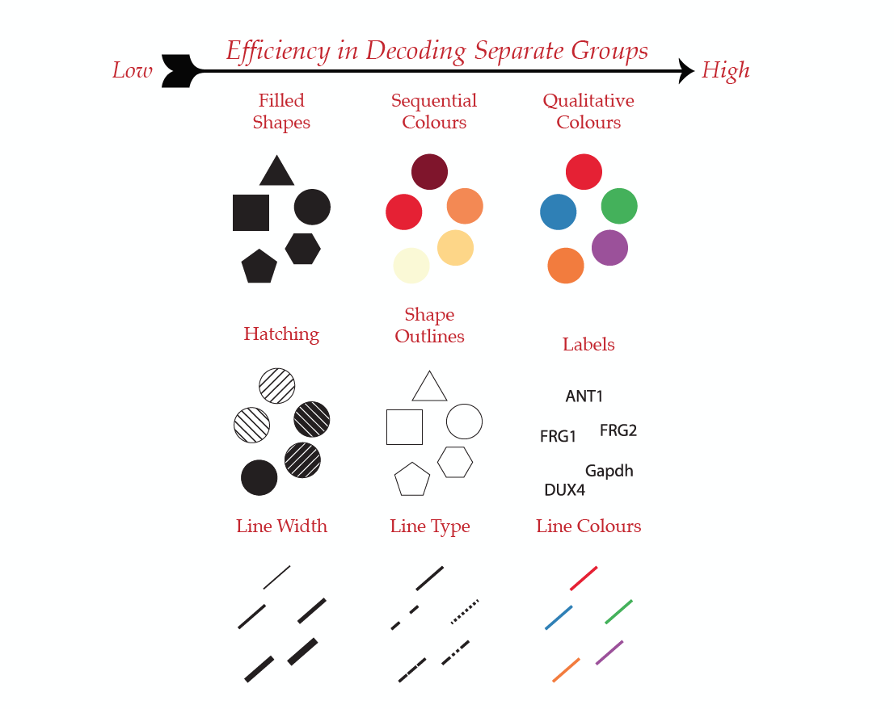
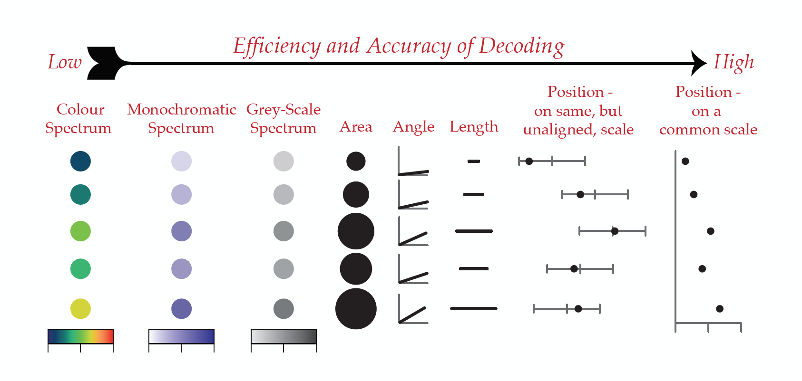

```{r setup, include=FALSE}
knitr::opts_chunk$set(echo = FALSE)

library(tidyverse)
library(ggbeeswarm)
library(lubridate)
library(magrittr)
library(repr)
library(gridExtra)
library(scales)
library(forcats)


#devtools::install_github('stephenturner/Tmisc')
library(Tmisc)
data(quartet)

df <- read_csv("https://raw.githubusercontent.com/aaronquinton/Rstudygroup_EDA/master/Data/avocado.csv")

df %<>% select(date = Date, avg_price_usd = AveragePrice, 
              tot_vol = `Total Volume`, tot_bags = `Total Bags`, region, type)

```

## Acknowledgements/References

- Online Text *R for Data Science* by Garrett Grolemund & Hadley Wickham  
[R for Data Science Ch. 7 - EDA](https://r4ds.had.co.nz/exploratory-data-analysis.html)

- The *Hass Avocado Board* and Justin Kiggins for compiling Avacado data  
[Dataset csv download link on Kaggle](https://www.kaggle.com/neuromusic/avocado-prices/home)

- Data Visualization published in *Nature Methods*  
[Nature.com Blog](http://blogs.nature.com/methagora/2013/07/data-visualization-points-of-view.html)

- DataCamp Course by Rick Scavetta: Data Visualization with ggplot


## Intro to Exploratory Data Analysis (EDA)

EDA is a creative process with the purpose of **exploring** your data to generate quality questions. It is not quantitative but more qualitative in nature and is iterative as the exploration inspires questions which become more exploration and so on.

>“There are no routine statistical questions, only questionable statistical routines.” — Sir David Cox  

A good starting place for questions:  

 - What type of variation occurs within my variables?  
 - What type of covariation occurs between my variables?

To answer these question its crucial to know if our data is Categorical or Numerical.


## The Motivation behind Visual EDA

```{r Anscombes quartet, fig.width=8, fig.height=3 }

ggplot(quartet, aes(x, y)) + 
  geom_point() +
  geom_smooth(method = lm, se = FALSE) +
  facet_grid(.~set) +
  theme_bw() +
  labs(title = "Anscombe's Quartet")

quartet %>%
  group_by(set) %>%
  summarize(mean(x), sd(x), mean(y), sd(y), cor(x,y))

```


## Before Getting Our Hands Dirty

**Finding Data**

- [Google Dataset Tool Search](https://toolbox.google.com/datasetsearch)
- [Kaggle Datasets](https://www.kaggle.com/datasets)
- [Awesome-Public-Dataset Repo](https://github.com/awesomedata/awesome-public-datasets)
- Built in R Datasets or Dataset packages on CRAN. To see the list type `data()` in the console.
  
  
## Exploring One Numerical Variable

```{r One Numerical Variable, echo = FALSE}

hist1no <- df %>% ggplot(aes(x = avg_price_usd)) + 
  geom_histogram(bins = 35) + 
  labs(title = "Histogram", x = "Avg Avacado Price (USD)", y = "Count")

density1no <- df %>% ggplot(aes(x = avg_price_usd)) + 
  geom_density() + 
  labs(title = "Density Plot", x = "Avg Avacado Price (USD)", y = "Density")

box1no <- df %>% ggplot(aes(x = 1, y = avg_price_usd)) + 
  geom_boxplot() + 
  coord_flip() + 
  labs(title = "Box Plot", y = "Avg Avacado Price (USD)")

ecdf1no <- df %>% ggplot(aes(x = avg_price_usd)) + 
  stat_ecdf() + 
  labs(title = "ECDF", x = "Avg Avacado Price (USD)", y = "Cumulative Probability")

grid.arrange(hist1no, density1no, box1no, ecdf1no, ncol = 2)

```

## One Numerical One Categorical

```{r One numerical One Categorical, echo = FALSE}

hist1no1cat <- df %>% ggplot(aes(x = avg_price_usd, fill = type)) + 
  geom_histogram(bins = 30, position  = "identity", alpha = 0.5) + 
  labs(title = "Histogram", x = "Avg Avacado Price (USD)", y = "Count") +
  guides(fill = FALSE)

density1no1cat <- df %>% ggplot(aes(x = avg_price_usd, fill = type)) + 
  geom_density(alpha = 0.5) + 
  labs(title = "Density Plot", x = "Avg Avacado Price (USD)", y = "Density") +
  guides(fill = FALSE)

box1no1cat <- df %>% ggplot(aes(x = type, y = avg_price_usd)) + 
  geom_boxplot() + 
  coord_flip() + 
  labs(title = "Box Plot", y = "Avg Avacado Price (USD)", x = "Avacado Type") +
  guides(fill = FALSE)

ecdf1no1cat <- df %>% ggplot(aes(x = avg_price_usd, col = type)) + 
  stat_ecdf() + 
  labs(title = "ECDF", x = "Avg Avacado Price (USD)", y = "Cumulative Probability") +
  guides(col = FALSE)

grid.arrange(hist1no1cat, density1no1cat, box1no1cat, ecdf1no1cat, ncol = 2)

```

## One Numerical One Categorical (Cont.)

Using `geom_jitter()` and `geom_quasirandom()` with the data set filtered to the region New York.

```{r One numerical One Categorical cont., echo = FALSE}

BoxJitter1no1cat <- df %>% filter(region == "NewYork") %>% 
  ggplot(aes(x = type, y = avg_price_usd)) + 
  geom_boxplot() +
  geom_jitter(alpha = 0.5) + 
  labs(title = "Box and Jitter Plot", y = "Avg Avacado Price (USD)", x = "Avacado Type") +
  guides(fill = FALSE)

ViolinJitter1no1cat <- df %>% filter(region == "NewYork") %>% 
  ggplot(aes(x = type, y = avg_price_usd)) + 
  geom_quasirandom() + 
  labs(title = "Violin Jitter Plot", y = "Avg Avacado Price (USD)", x = "Avacado Type") +
  guides(fill = FALSE)

grid.arrange(BoxJitter1no1cat, ViolinJitter1no1cat, ncol = 2)

```

## Two Numerical Variables

```{r Two Numerical Variables, echo = FALSE}

scatter2no <- df %>%
  ggplot(aes(x = avg_price_usd, y = tot_vol)) + 
    geom_point(alpha = 0.3) +
    annotation_logticks(sides = "l") +
    scale_y_log10(breaks = trans_breaks("log10", function(x) 10^x),
                  labels = trans_format("log10", math_format(10^.x))) +
    labs(title = "Scatter Plot", x = "Avg Avacado Price (USD)", y = "Total Volume")
    

bin2d2no <- df %>%
  ggplot(aes(x = avg_price_usd, y = tot_vol)) + 
    geom_bin2d() +
    annotation_logticks(sides = "l") +
    scale_y_log10(breaks = trans_breaks("log10", function(x) 10^x),
                  labels = trans_format("log10", math_format(10^.x))) +
    labs(title = "2d Bin Plot", x = "Avg Avacado Price (USD)", y = "Total Volume") +
    guides(fill = FALSE)

grid.arrange(scatter2no, bin2d2no, ncol = 2)

```

## Exploring More than Two Variables {.smaller}

So far we have been primarily been using position mapping and/or color mapping. But we are able to map more variables to the following aesthetics:

|Aesthetic|Description|
|---|---|
|x|X axis position|
|y|Y axis position|
|color|Color of dots, outlines of other shapes|
|fill|Fill color|
|size|Diameter of points, thickness of lines|
|alpha|Transparency|
|linetype|Line dash pattern|
|labels|Text on a plot or axes|
|shape|Shape|

## Categorical Visual Guide

```{r, out.width = "500px"}

```

Image adapted by DataCamp from Wong,B, *Nat Met*, 7(9), 2010, p665

## Continous Visual Guide 

```{r, out.width = "750px"}

```
Image adapted by DataCamp from Wong,B, *Nat Met*, 7(9), 2010, p665

